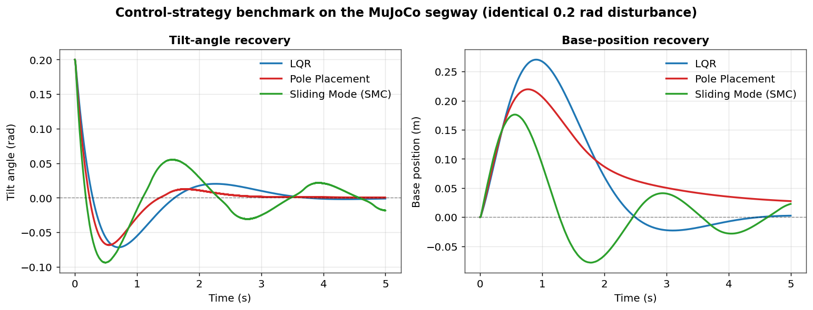

<div align="center">

# Control Strategies for a Two-Wheeled Inverted Pendulum

**A comparative study of classical, optimal, robust, predictive, nonlinear and adaptive controllers for stabilizing a self-balancing (segway-type) robot — derived in MATLAB and validated in a MuJoCo physics simulation, with every controller's parameters tuned by genetic-algorithm optimization.**

[](https://www.mathworks.com/)
[](https://www.python.org/)
[](https://mujoco.org/)
[](https://python-control.org/)
[](LICENSE)


<sub>The two-wheeled inverted pendulum recovering from an initial tilt and balancing upright in the MuJoCo simulation.</sub>

</div>

---

## Table of Contents

- [Overview](#overview)
- [The System](#the-system)
- [Control Strategies](#control-strategies)
- [Benchmark](#benchmark)
- [Methodology](#methodology)
- [Repository Structure](#repository-structure)
- [Getting Started](#getting-started)
- [Reproducing the Figures](#reproducing-the-figures)
- [Technical Reports](#technical-reports)
- [Technology Stack](#technology-stack)
- [License](#license)

---

## Overview

The two-wheeled inverted pendulum is one of the canonical benchmark problems in control theory: an inherently unstable, underactuated, nonlinear system that must be actively stabilized. It is the dynamic heart of self-balancing robots and personal transporters such as the Segway.

This project takes a single, consistent plant and asks a focused question: **how do different families of control strategies compare when applied to the same balancing problem?** To answer it, more than a dozen controllers were derived from first principles in MATLAB, ported to a Python simulation running on the MuJoCo physics engine, and tuned with the same optimization procedure so that the comparison is fair. The result is a broad, hands-on survey spanning optimal, classical, robust, predictive, nonlinear, adaptive and learning-based control.

---

## The System

The plant is modelled as a cart (the wheel/base assembly) with an inverted pendulum (the body) hinged on top. The state is

$$
x = \begin{bmatrix} x & \dot{x} & \theta & \dot{\theta} \end{bmatrix}^{\top}
$$

where $x$ is the base position, $\theta$ is the tilt angle from vertical, and the single control input $u$ is the force driving the base. Linearizing about the upright equilibrium gives the state-space model used for controller design:

$$
\dot{x} = A x + B u, \qquad
A = \begin{bmatrix} 0 & 1 & 0 & 0 \\ 0 & 0 & -\frac{bd}{\Delta} & 0 \\ 0 & 0 & 0 & 1 \\ 0 & 0 & \frac{ad}{\Delta} & 0 \end{bmatrix}, \qquad
B = \begin{bmatrix} 0 \\ \frac{c}{\Delta} \\ 0 \\ -\frac{b}{\Delta} \end{bmatrix}
$$

with $a = 2m_w + m_p + 2I_w/r^2$, $\;b = m_p l$, $\;c = m_p l^2 + I_p$, $\;d = m_p g l$, and $\Delta = ac - b^2$.

| Parameter | Symbol | Value |
|-----------|:------:|------:|
| Pendulum (body) mass | $m_p$ | 5.0 kg |
| Wheel mass (each) | $m_w$ | 0.432 kg |
| Pendulum length | $l$ | 0.40 m |
| Wheel radius | $r$ | 0.0726 m |
| Actuator force limit | $u_{\max}$ | ±50 N |
| Simulation timestep | $\Delta t$ | 1 ms |

The physics are simulated in MuJoCo (`segway.xml`) at 1 kHz, so every controller is evaluated against the full nonlinear dynamics — not just the linear model it was designed on.

<div align="center">

<br/>
<sub>A representative closed-loop run: the LQR controller drives the tilt angle back to vertical after a 0.2 rad disturbance, with the base returning near its origin and a smooth, bounded control effort.</sub>
</div>

---

## Control Strategies

Each strategy below is implemented as a standalone MATLAB derivation and (for most) a Python/MuJoCo simulation, together with an optimizer that tunes its parameters.

| Strategy | Family | MATLAB | Simulation |
|----------|--------|:------:|:----------:|
| LQR (Linear Quadratic Regulator) | Optimal | ✓ | ✓ |
| Iterative LQR (iLQR) | Optimal | ✓ | |
| LQR with input delay (Padé) | Optimal | ✓ | |
| Pole Placement | Classical / linear | ✓ | ✓ |
| Model Predictive Control (MPC) | Predictive | ✓ | ✓ |
| EPSAC predictive control | Predictive | ✓ | ✓ |
| H-infinity ($H_\infty$) | Robust | ✓ | ✓ |
| Sliding Mode Control (SMC) | Robust / nonlinear | ✓ | ✓ |
| LQR + SMC + Backstepping | Robust / nonlinear | ✓ | ✓ |
| Nonlinear Dynamic Inversion (NDI) | Nonlinear | ✓ | |
| NDI + SMC | Nonlinear | ✓ | |
| Carleman Linearization + LQR | Nonlinear | ✓ | ✓ |
| Linear Parameter-Varying (LPV) | Gain-scheduling | ✓ | ✓ |
| LQR + L1 Adaptive | Adaptive | ✓ | ✓ |
| DSC + Neural Network + NMPC | Adaptive / learning | ✓ | ✓ |

Additional experimental controllers explored in the study (in `Matlab/Remod/Not working/`) include **ADRC + MRAC + ESO + SMC**, **IDA-PBC** (passivity-based), **Koopman eigenfunctions + LQR** (data-driven), and **Sontag's universal formula**.

---

## Benchmark

To compare strategies on equal footing, several controllers were run on the identical MuJoCo plant, each recovering from the same 0.2 rad initial tilt:

<div align="center">

</div>

| Controller | Settling time | Control effort | Character |
|------------|:-------------:|:--------------:|-----------|
| **Pole Placement** | ~1.1 s | high (saturating) | fastest recovery, aggressive use of the actuator |
| **LQR** | ~2.4 s | low (RMS ≈ 2.4 N) | smooth, energy-efficient, well-damped |
| **Sliding Mode (SMC)** | ~4.0 s | high (saturating) | robust to model error, some chattering |

*Settling measured as the tilt angle staying within ±0.02 rad. Pole placement and SMC drive the actuator to its ±50 N limit during recovery, trading control effort for speed and robustness, while LQR achieves a comfortable balance between settling time and effort.*

---

## Methodology

The project follows the same workflow for every controller:

1. **Modelling (MATLAB).** The nonlinear equations of motion are derived (`Dynamics_Redo.mlx`) and linearized about the upright equilibrium to obtain the state-space model above.
2. **Controller design (MATLAB).** Each strategy is synthesized for the plant — gain matrices, sliding surfaces, prediction horizons, observers, and so on — and validated in MATLAB (see the per-strategy PDF reports).
3. **Parameter optimization.** Rather than hand-tuning, each controller's parameters are optimized with a **genetic algorithm** (DEAP / PyGAD in Python, custom routines in MATLAB) that minimizes the closed-loop **settling time** for recovery from an initial tilt. Every strategy folder contains both the controller and its `optim_*` optimizer, along with the resulting tuned parameters.
4. **Physics validation (Python + MuJoCo).** The tuned controllers are run against the full nonlinear dynamics in MuJoCo to confirm they hold up beyond the linear design model.

---

## Repository Structure

```
Control-strategies-for-two-wheeled-inverted-pendulum/
├── Matlab/Remod/                 # MATLAB derivations, designs, optimizers, and PDF reports
│   ├── LQR/  Pole Placement/  MPC/  H infinity/  Sliding Mode/  LPV/  NDI/  EPSAC/
│   ├── Carleman linearsation + LQR/   LQR+L1 Adaptive/   LQR+SMC+Backstepping/
│   ├── DSC+NN+NMPC/                   Dynamics_Redo.mlx   (equations of motion)
│   └── Not working/              # Experimental controllers (ADRC, IDA-PBC, Koopman, Sontag)
└── Simulation/                   # Python + MuJoCo simulations
    ├── segway.xml                # MuJoCo model of the two-wheeled inverted pendulum
    ├── simulate_segway.py        # Interactive viewer (Qt + OpenGL)
    └── <strategy>/               # segway_control_*.py  +  optim_segway_control_*.py
```

Each control strategy keeps its implementation, its optimizer, and its tuned-parameter output together, so any single method can be studied in isolation.

---

## Getting Started

### Simulation (Python + MuJoCo)

**Prerequisites:** Python 3.9+, and:

```bash
pip install mujoco numpy scipy control matplotlib cvxpy
# some controllers additionally use: pygad / deap (optimization), PySide6 (the viewer)
```

**Run a controller** (for example, LQR):

```bash
cd Simulation/LQR
python segway_control_lqr.py
```

A MuJoCo window opens showing the robot balancing, and the state and control trajectories are plotted when the run ends. Every strategy folder follows the same pattern (`segway_control_<method>.py`), and the matching `optim_*` script re-runs the genetic-algorithm tuning.

### Modelling and design (MATLAB)

Open the `.m` file for any strategy in `Matlab/Remod/<strategy>/` and run it in MATLAB. `Dynamics_Redo.mlx` contains the full equation-of-motion derivation as a live script.

---

## Reproducing the Figures

The plots in this README are produced from the simulation by stabilizing the MuJoCo model from a 0.2 rad tilt and recording the state and control trajectories — the base-position, tilt-angle and control-force histories shown above come directly from those runs.

---

## Technical Reports

Every strategy includes a detailed PDF write-up with its derivation, design choices and MATLAB results — for example:

- [`LQR.pdf`](Matlab/Remod/LQR/LQR.pdf)
- [`MPC.pdf`](Matlab/Remod/MPC/MPC.pdf)
- [`SMC.pdf`](Matlab/Remod/Sliding%20Mode/SMC.pdf)
- [`Hinf.pdf`](Matlab/Remod/H%20infinity/Hinf.pdf)
- [`LQR+SMC+Backstepping.pdf`](Matlab/Remod/LQR%2BSMC%2BBackstepping/LQR%2BSMC%2BBackstepping.pdf)
- [`DSC+NN+NMPC.pdf`](Matlab/Remod/DSC%2BNN%2BNMPC/DSC%2BNN%2BNMPC.pdf)

…and one for each remaining strategy in its respective folder.

---

## Technology Stack

| Area | Tools |
|------|-------|
| Modelling & control design | MATLAB, Control System Toolbox, Symbolic Math |
| Simulation | Python, MuJoCo, `python-control`, NumPy, SciPy, Matplotlib |
| Optimization | Genetic algorithms (DEAP, PyGAD) |
| Optimal control | CVXPY / convex solvers (MPC), CasADi |
| Visualization | MuJoCo renderer, PySide6 / Qt OpenGL viewer |

---

## License

Released under the [MIT License](LICENSE).
