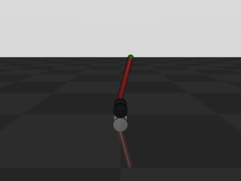
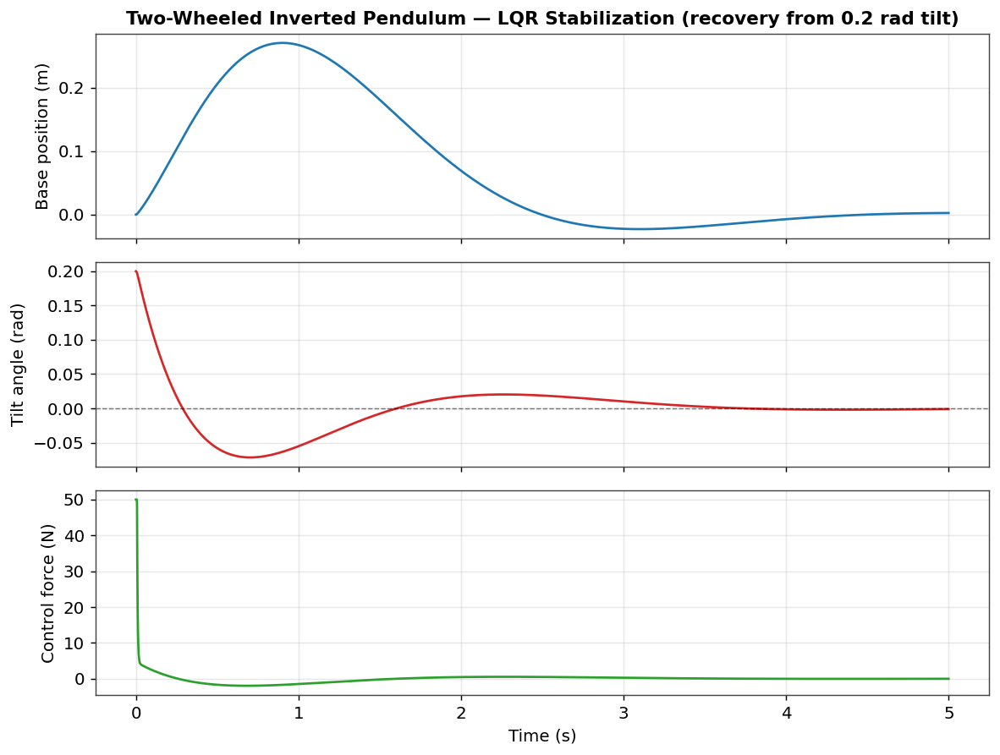
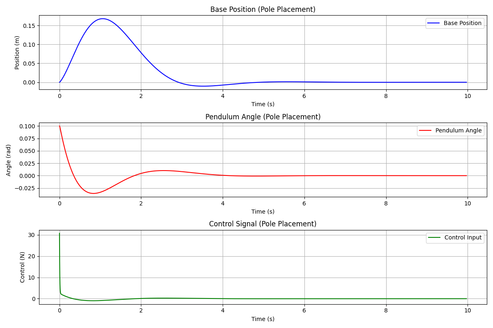
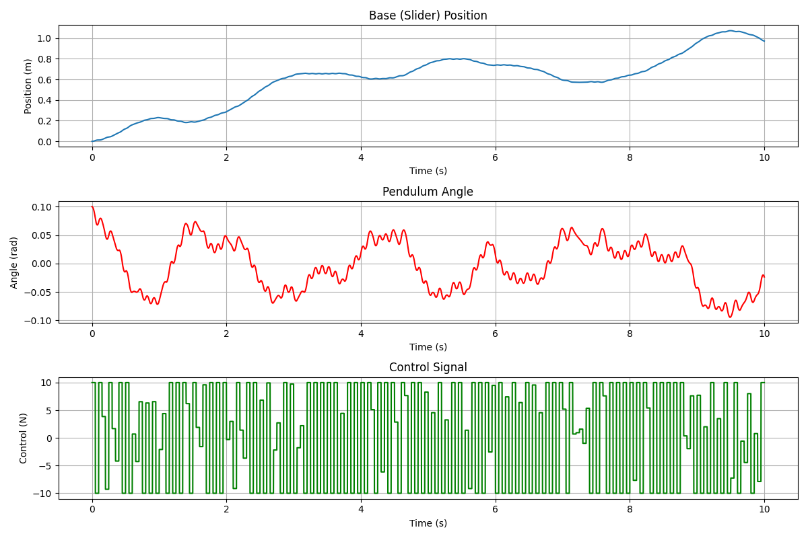
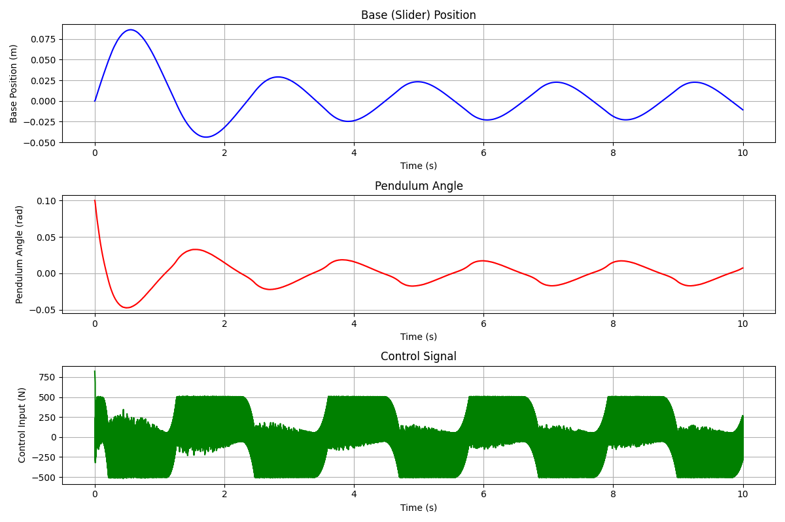
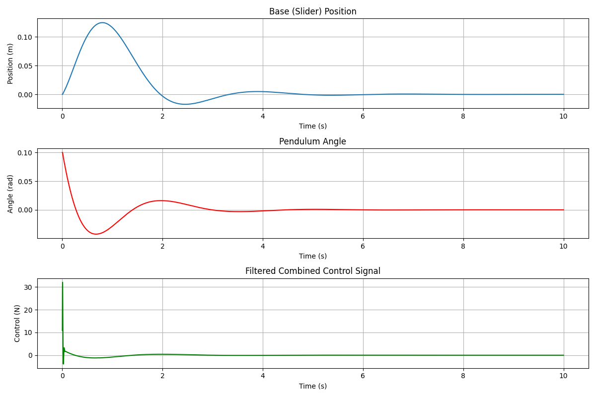
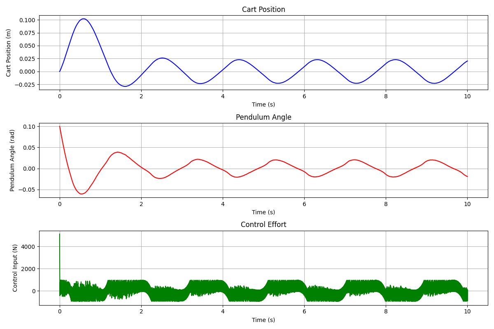
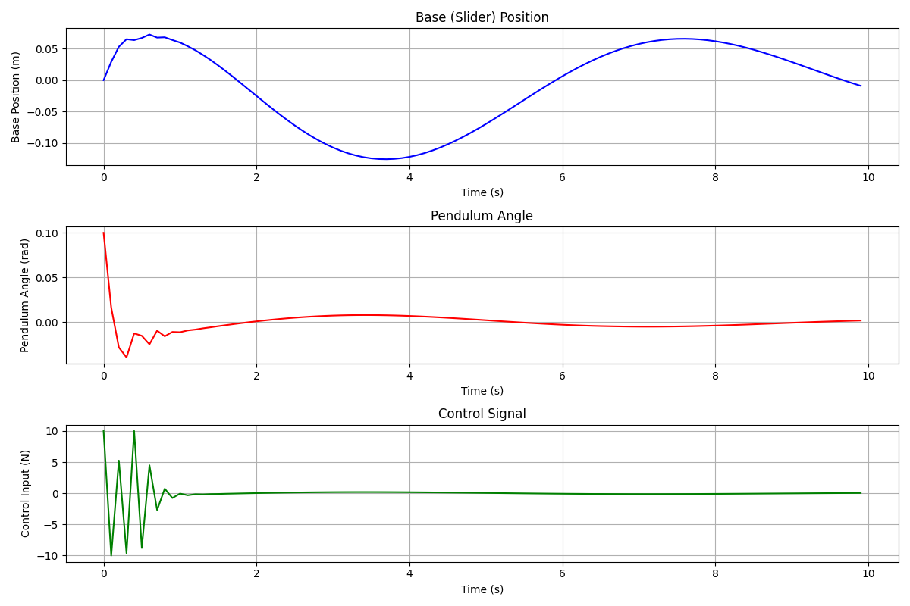
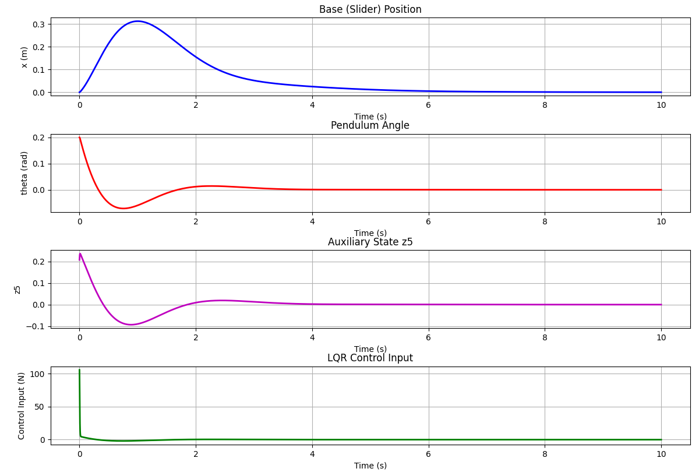
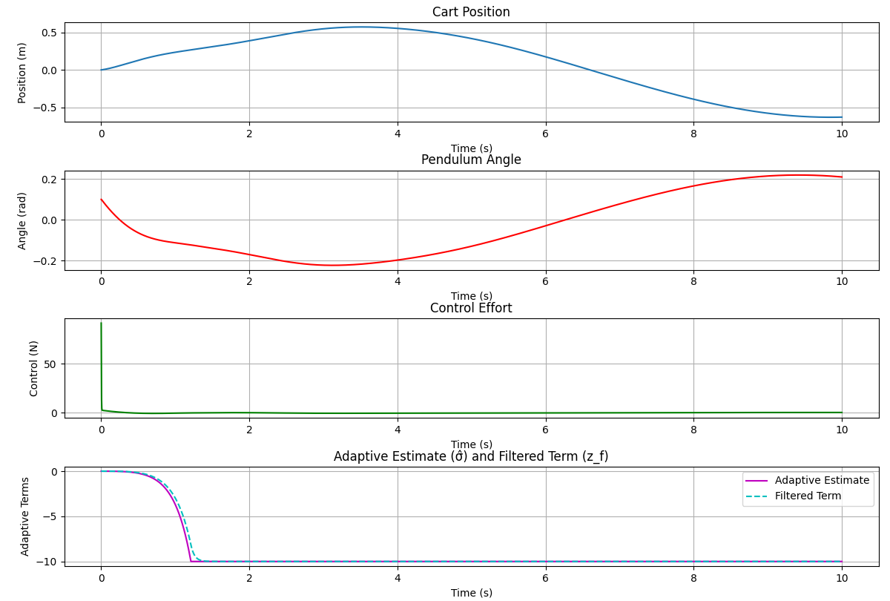

> [!NOTE]
> **This project has a successor:** [segway-control-suite](https://github.com/Manas-arumalla/segway-control-suite) re-implements and benchmarks these control strategies in Python/MuJoCo with a tested, CI-verified suite. This repository remains the original MATLAB modeling & derivation work.

<div align="center">

# Control Strategies for a Two-Wheeled Inverted Pendulum

**A comparative study of classical, optimal, robust, predictive, nonlinear and adaptive controllers for stabilizing a self-balancing (segway-type) robot — derived in MATLAB and validated in a MuJoCo physics simulation, with every controller's parameters tuned by genetic-algorithm optimization.**

[](https://www.mathworks.com/)
[](https://www.python.org/)
[](https://mujoco.org/)
[](https://python-control.org/)
[](LICENSE)



<sub>The two-wheeled inverted pendulum recovering from an initial tilt and balancing upright in the MuJoCo simulation.</sub>

</div>

---

## Table of Contents

- [Overview](#overview)
- [The System](#the-system)
- [Control Strategies](#control-strategies)
- [Benchmark](#benchmark)
- [Methodology](#methodology)
- [Repository Structure](#repository-structure)
- [Getting Started](#getting-started)
- [Reproducing the Figures](#reproducing-the-figures)
- [Technical Reports](#technical-reports)
- [Technology Stack](#technology-stack)
- [License](#license)

---

## Overview

The two-wheeled inverted pendulum is one of the canonical benchmark problems in control theory: an inherently unstable, underactuated, nonlinear system that must be actively stabilized. It is the dynamic heart of self-balancing robots and personal transporters such as the Segway.

This project takes a single, consistent plant and asks a focused question: **how do different families of control strategies compare when applied to the same balancing problem?** To answer it, more than a dozen controllers were derived from first principles in MATLAB, ported to a Python simulation running on the MuJoCo physics engine, and tuned with the same optimization procedure so that the comparison is fair. The result is a broad, hands-on survey spanning optimal, classical, robust, predictive, nonlinear, adaptive and learning-based control.

---

## The System

The plant is modelled as a cart (the wheel/base assembly) with an inverted pendulum (the body) hinged on top. The state is

$$
x = \begin{bmatrix} x & \dot{x} & \theta & \dot{\theta} \end{bmatrix}^{\top}
$$

where $x$ is the base position, $\theta$ is the tilt angle from vertical, and the single control input $u$ is the force driving the base. Linearizing about the upright equilibrium gives the state-space model used for controller design:

$$
\dot{x} = A x + B u, \qquad
A = \begin{bmatrix} 0 & 1 & 0 & 0 \\ 0 & 0 & -\frac{bd}{\Delta} & 0 \\ 0 & 0 & 0 & 1 \\ 0 & 0 & \frac{ad}{\Delta} & 0 \end{bmatrix}, \qquad
B = \begin{bmatrix} 0 \\ \frac{c}{\Delta} \\ 0 \\ -\frac{b}{\Delta} \end{bmatrix}
$$

with $a = 2m_w + m_p + 2I_w/r^2$, $\;b = m_p l$, $\;c = m_p l^2 + I_p$, $\;d = m_p g l$, and $\Delta = ac - b^2$.

| Parameter | Symbol | Value |
|-----------|:------:|------:|
| Pendulum (body) mass | $m_p$ | 5.0 kg |
| Wheel mass (each) | $m_w$ | 0.432 kg |
| Pendulum length | $l$ | 0.40 m |
| Wheel radius | $r$ | 0.0726 m |
| Actuator force limit | $u_{\max}$ | ±50 N |
| Simulation timestep | $\Delta t$ | 1 ms |

The physics are simulated in MuJoCo (`segway.xml`) at 1 kHz, so every controller is evaluated against the full nonlinear dynamics — not just the linear model it was designed on.

<div align="center">

<br/>
<sub>A representative closed-loop run: the LQR controller drives the tilt angle back to vertical after a 0.2 rad disturbance, with the base returning to its origin after a short excursion.</sub>
</div>

---

## Control Strategies

Each strategy below is implemented as a standalone MATLAB derivation and (for most) a Python/MuJoCo simulation, together with an optimizer that tunes its parameters.

| Strategy | Family | MATLAB | Simulation |
|----------|--------|:------:|:----------:|
| LQR (Linear Quadratic Regulator) | Optimal | ✓ | ✓ |
| Iterative LQR (iLQR) | Optimal | ✓ | |
| LQR with input delay (Padé) | Optimal | ✓ | |
| Pole Placement | Classical / linear | ✓ | ✓ |
| Model Predictive Control (MPC) | Predictive | ✓ | ✓ |
| EPSAC predictive control | Predictive | ✓ | ✓ |
| H-infinity ($H_\infty$) | Robust | ✓ | ✓ |
| Sliding Mode Control (SMC) | Robust / nonlinear | ✓ | ✓ |
| LQR + SMC + Backstepping | Robust / nonlinear | ✓ | ✓ |
| Nonlinear Dynamic Inversion (NDI) | Nonlinear | ✓ | |
| NDI + SMC | Nonlinear | ✓ | |
| Carleman Linearization + LQR | Nonlinear | ✓ | ✓ |
| Linear Parameter-Varying (LPV) | Gain-scheduling | ✓ | ✓ |
| LQR + L1 Adaptive | Adaptive | ✓ | ✓ |
| DSC + Neural Network + NMPC | Adaptive / learning | ✓ | ✓ |

Additional experimental controllers explored in the study (in `Matlab/Remod/Not working/`) include **ADRC + MRAC + ESO + SMC**, **IDA-PBC** (passivity-based), **Koopman eigenfunctions + LQR** (data-driven), and **Sontag's universal formula**.

---

## Benchmark

Every controller was tuned with the same genetic-algorithm procedure and evaluated on the identical model, each recovering from the same initial tilt. The table reports the settling time of the **pendulum angle** and the **base position** for each strategy, sorted by how quickly the tilt is brought under control.

| Control strategy | Pendulum-angle settling (s) | Base-position settling (s) |
|------------------|:---------------------------:|:--------------------------:|
| **NDI + SMC** | **0.234** | 0.808 |
| LQR + SMC + Backstepping | 0.495 | 2.009 |
| Pole Placement | 0.690 | 0.740 |
| H-infinity | 0.720 | 0.896 |
| LQR | 0.960 | 0.890 |
| LPV | 1.145 | 1.412 |
| LQR + L1 Adaptive | 1.147 | 2.437 |
| Carleman Linearisation + LQR | 1.510 | 1.150 |
| Sliding Mode (SMC) | 2.424 | 4.633 |
| EPSAC | 2.500 | 2.700 |
| MPC | 3.500 | 2.765 |

**Key findings.** NDI + SMC achieved the fastest balance recovery (0.234 s on the pendulum angle), with Pole Placement and H-infinity also settling in under a second. LQR delivered the best overall trade-off between speed, smoothness and control effort, while the predictive methods (MPC, EPSAC) traded raw speed for explicit constraint handling. Several controllers stabilize the tilt quickly but take longer to recentre the base — a reminder that this underactuated system forces a genuine compromise between the two objectives.

<details>
<summary><b>Per-controller response plots</b> (click to expand)</summary>

<br/>

Each plot shows the base position, pendulum (tilt) angle and control signal as the controller recovers from an initial disturbance.

**LQR** &nbsp; → see [The System](#the-system) above

**Pole Placement**


**MPC**


**Sliding Mode Control**


**LQR + SMC + Backstepping**


**LPV**


**EPSAC**


**Carleman Linearisation + LQR**


**LQR + L1 Adaptive**


</details>

---

## Methodology

The project follows the same workflow for every controller:

1. **Modelling (MATLAB).** The nonlinear equations of motion are derived (`Dynamics_Redo.mlx`) and linearized about the upright equilibrium to obtain the state-space model above.
2. **Controller design (MATLAB).** Each strategy is synthesized for the plant — gain matrices, sliding surfaces, prediction horizons, observers, and so on — and validated in MATLAB (see the per-strategy PDF reports).
3. **Parameter optimization.** Rather than hand-tuning, a generalized **genetic-algorithm** framework (DEAP / PyGAD in Python, custom routines in MATLAB) tunes every controller. Each controller's parameters are encoded as a chromosome and a fitness function scores closed-loop **settling time and stability** for recovery from an initial tilt. The same procedure was applied across all the self-balancing controllers, yielding tuned parameters such as the LQR weights $Q = \mathrm{diag}(9786.7,\, 0.75,\, 0.63,\, 1.22),\ R = 0.001$. Every strategy folder contains both the controller and its `optim_*` optimizer alongside the resulting parameters.
4. **Physics validation (Python + MuJoCo).** The tuned controllers are run against the full nonlinear dynamics in MuJoCo to confirm they hold up beyond the linear design model.

---

## Repository Structure

```
Control-strategies-for-two-wheeled-inverted-pendulum/
├── Matlab/Remod/                 # MATLAB derivations, designs, optimizers, and PDF reports
│   ├── LQR/  Pole Placement/  MPC/  H infinity/  Sliding Mode/  LPV/  NDI/  EPSAC/
│   ├── Carleman linearsation + LQR/   LQR+L1 Adaptive/   LQR+SMC+Backstepping/
│   ├── DSC+NN+NMPC/                   Dynamics_Redo.mlx   (equations of motion)
│   └── Not working/              # Experimental controllers (ADRC, IDA-PBC, Koopman, Sontag)
└── Simulation/                   # Python + MuJoCo simulations
    ├── segway.xml                # MuJoCo model of the two-wheeled inverted pendulum
    ├── simulate_segway.py        # Interactive viewer (Qt + OpenGL)
    └── <strategy>/               # segway_control_*.py  +  optim_segway_control_*.py
```

Each control strategy keeps its implementation, its optimizer, and its tuned-parameter output together, so any single method can be studied in isolation.

---

## Getting Started

### Simulation (Python + MuJoCo)

**Prerequisites:** Python 3.9+, and:

```bash
pip install mujoco numpy scipy control matplotlib cvxpy
# some controllers additionally use: pygad / deap (optimization), PySide6 (the viewer)
```

**Run a controller** (for example, LQR):

```bash
cd Simulation/LQR
python segway_control_lqr.py
```

A MuJoCo window opens showing the robot balancing, and the state and control trajectories are plotted when the run ends. Every strategy folder follows the same pattern (`segway_control_<method>.py`), and the matching `optim_*` script re-runs the genetic-algorithm tuning.

### Modelling and design (MATLAB)

Open the `.m` file for any strategy in `Matlab/Remod/<strategy>/` and run it in MATLAB. `Dynamics_Redo.mlx` contains the full equation-of-motion derivation as a live script.

---

## Reproducing the Figures

The per-controller response plots and the benchmark settling times come from the MATLAB and Python simulations, recorded as each tuned controller stabilizes the model from an initial tilt. The balancing animation at the top is rendered directly from the MuJoCo model under closed-loop control.

---

## Technical Reports

Every strategy includes a detailed PDF write-up with its derivation, design choices and MATLAB results — for example:

- [`LQR.pdf`](Matlab/Remod/LQR/LQR.pdf)
- [`MPC.pdf`](Matlab/Remod/MPC/MPC.pdf)
- [`SMC.pdf`](Matlab/Remod/Sliding%20Mode/SMC.pdf)
- [`Hinf.pdf`](Matlab/Remod/H%20infinity/Hinf.pdf)
- [`LQR+SMC+Backstepping.pdf`](Matlab/Remod/LQR%2BSMC%2BBackstepping/LQR%2BSMC%2BBackstepping.pdf)
- [`DSC+NN+NMPC.pdf`](Matlab/Remod/DSC%2BNN%2BNMPC/DSC%2BNN%2BNMPC.pdf)

…and one for each remaining strategy in its respective folder.

---

## Technology Stack

| Area | Tools |
|------|-------|
| Modelling & control design | MATLAB, Control System Toolbox, Symbolic Math |
| Simulation | Python, MuJoCo, `python-control`, NumPy, SciPy, Matplotlib |
| Optimization | Genetic algorithms (DEAP, PyGAD) |
| Optimal control | CVXPY / convex solvers (MPC), CasADi |
| Visualization | MuJoCo renderer, PySide6 / Qt OpenGL viewer |

---

## License

Released under the [MIT License](LICENSE).
